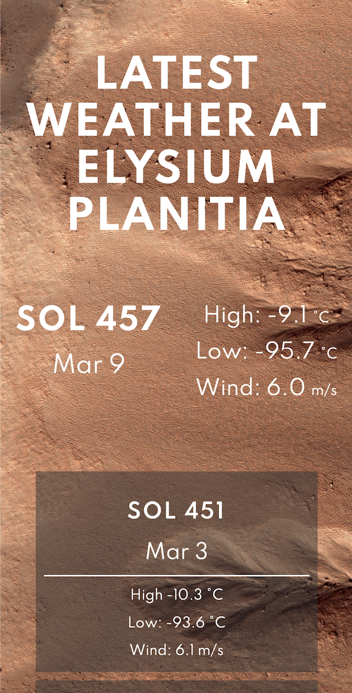

# insight-weather-display

## Description
This project gets the latest temperature and wind speed data from NASA's InSight lander using the InSight API. The design is inspired by [NASA's Mars Weather page](https://mars.nasa.gov/insight/weather/).

## Setup
1. Obtain a NASA API key from [NASA APIs](https://api.nasa.gov)
2. Add the API key to `/.env`

## Running
1. `$ npm i`
2. `$ node app.js`

## Images

